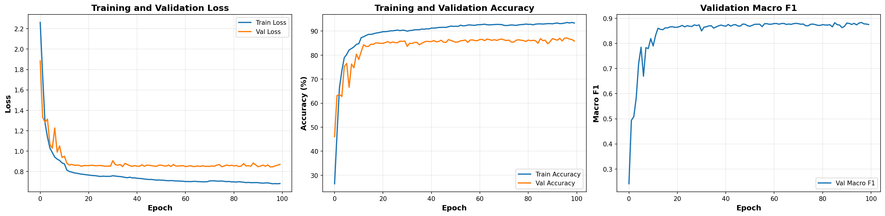
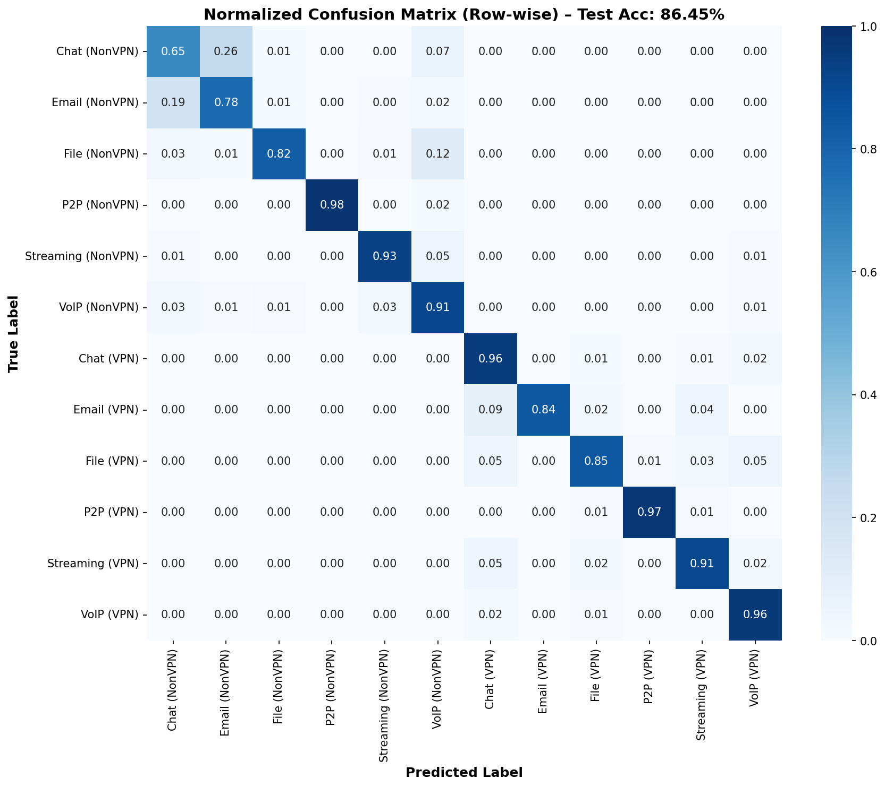
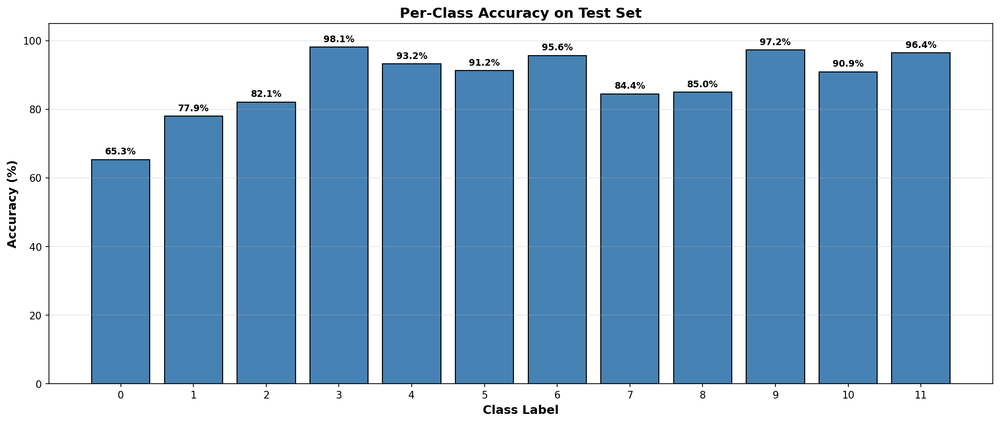

# AttentionNet: Network Traffic Classification with Hybrid CNN-Transformer Architecture

[](https://www.python.org/downloads/)
[](https://pytorch.org/)
[](LICENSE)

A deep learning-based network traffic classifier that uses a hybrid CNN-Transformer architecture to identify and classify network traffic patterns. The system converts network flows into 28x28 grayscale images and achieves 86.45% accuracy in distinguishing between 12 traffic classes (6 application types across VPN and non-VPN scenarios). The classifier works on traffic patterns regardless of application-layer encryption (TLS, HTTPS, QUIC) by analyzing packet metadata and flow characteristics.

---

## Table of Contents

- [Architecture](#architecture)
- [Installation](#installation)
- [Dataset](#dataset)
- [Usage](#usage)
  - [Preprocessing](#preprocessing)
  - [Training](#training)
  - [Testing](#testing)
  - [Demo](#demo)
- [Project Structure](#project-structure)
- [Results](#results)
- [Citation](#citation)
- [License](#license)

---

## Architecture

### Primary Model: TrafficCNN_TinyTransformer

AttentionNet uses a hybrid CNN-Transformer architecture as its primary model:

#### CNN Backbone
- **Conv Layer 1**: 1→64 channels, 3x3 kernel, BatchNorm, ReLU, MaxPool (28x28 → 14x14)
- **Conv Layer 2**: 64→128 channels, 3x3 kernel, BatchNorm, ReLU, MaxPool (14x14 → 7x7)

### Transformer Module
- **Input**: 49 spatial tokens (7x7 grid) with 128-dimensional embeddings
- **Positional Embedding**: Learnable parameters (1, 49, 128)
- **Encoder Layers**: 2 TransformerEncoder layers
- **Attention Heads**: 4 multi-head self-attention
- **Feed-forward Dimension**: 256
- **Activation**: GELU
- **Dropout**: 0.1

### Classification Head
- Global average pooling over tokens
- FC Layer 1: 128 → 128 (Dropout 0.5, ReLU)
- FC Layer 2: 128 → 128 (Dropout 0.3, ReLU)
- FC Layer 3: 128 → 12 (Dropout 0.2)

### Input Representation

Network flows are converted into 28x28 grayscale images where each pixel represents a byte value (0-255). The spatial patterns in these images capture characteristics of different traffic types.


*Figure 1: Sample flow images from different traffic classes showing visual patterns that distinguish various application types.*


*Figure 2: Detailed grid showing 50 samples per traffic class. Each row represents a different traffic category (NonVPN and VPN variants).*


*Figure 3: Distribution of non-zero pixel densities across all traffic classes, showing data quality and flow characteristics.*

### Traffic Classes

| ID | Class | Description |
|----|-------|-------------|
| 0 | Chat (NonVPN) | Chat applications without VPN |
| 1 | Email (NonVPN) | Email applications without VPN |
| 2 | File (NonVPN) | File transfer without VPN |
| 3 | P2P (NonVPN) | P2P applications without VPN |
| 4 | Streaming (NonVPN) | Streaming services without VPN |
| 5 | VoIP (NonVPN) | VoIP calls without VPN |
| 6 | Chat (VPN) | Chat applications through VPN tunnel |
| 7 | Email (VPN) | Email applications through VPN tunnel |
| 8 | File (VPN) | File transfer through VPN tunnel |
| 9 | P2P (VPN) | P2P applications through VPN tunnel |
| 10 | Streaming (VPN) | Streaming services through VPN tunnel |
| 11 | VoIP (VPN) | VoIP calls through VPN tunnel |

**Note**: NonVPN traffic may still be encrypted at the application layer (TLS, HTTPS, QUIC, etc.). The classification distinguishes between traffic sent directly vs. traffic tunneled through a VPN.

### Alternative Model Architectures

The project includes additional model architectures for comparison and experimentation:

**1. TrafficCNN_Tiny** (`src/model/cnn2d_2layer.py`)
- Lightweight CNN-only model (2 convolutional layers)
- Faster inference, lower computational requirements
- Suitable for resource-constrained environments

**2. TrafficCNN_Transformer** (`src/model/hybrid.py`)
- Full-size hybrid CNN-Transformer model
- More Transformer layers and parameters than TinyTransformer
- Higher capacity for complex pattern learning

**3. TrafficCNN_Backbone** (`src/model/cnn2d_backbone.py`)
- CNN-only baseline model
- Useful for comparing CNN vs. CNN+Transformer performance
- No attention mechanism

The primary model used for results reported in this README is **TrafficCNN_TinyTransformer**, which provides the best balance between accuracy and computational efficiency.

---

## Installation

### Prerequisites

- Python 3.11 or higher
- CUDA-capable GPU (optional, recommended for training)
- Apple Silicon Mac with MPS support (optional)
- 8GB+ RAM recommended

### Setup

```bash
# Clone repository
git clone https://github.com/yourusername/AttentionNet.git
cd AttentionNet

# Create virtual environment
python -m venv venv
source venv/bin/activate  # On Windows: venv\Scripts\activate

# Install dependencies
pip install -r requirements.txt
```

### Dependencies

Core packages:
- `torch>=2.0.0` - PyTorch deep learning framework
- `numpy>=1.24.0` - Numerical computing
- `matplotlib>=3.7.0` - Plotting and visualization
- `seaborn>=0.12.0` - Statistical visualizations
- `scikit-learn>=1.3.0` - Machine learning metrics
- `scapy>=2.5.0` - PCAP file processing
- `tqdm>=4.65.0` - Progress bars
- `streamlit>=1.28.0` - Web demo interface
- `pandas>=2.0.0` - Data manipulation (for demo)

---

## Dataset

This project uses the ISCXVPN2016 dataset containing:
- **VPN Traffic**: Application traffic routed through VPN tunnels
- **Non-VPN Traffic**: Application traffic sent directly (without VPN)
- **Application Categories**: Chat, Email, File Transfer, P2P, Streaming, VoIP

Note: Both VPN and NonVPN traffic may be encrypted at the application layer (TLS, HTTPS, QUIC). The distinction is whether the traffic is tunneled through a VPN.

### Dataset Structure

```
categorized_pcaps/
├── NonVPN/
│   ├── Chat/
│   ├── Email/
│   ├── File/
│   ├── P2P/
│   ├── Streaming/
│   └── VoIP/
└── VPN/
    ├── Chat/
    ├── Email/
    ├── File/
    ├── P2P/
    ├── Streaming/
    └── VoIP/
```

### Organizing the ISCX Dataset

Before preprocessing, use the `categorize_pcaps.py` script to organize raw ISCX dataset files into the proper structure:

```bash
python categorize_pcaps.py
```

**What it does:**
- Reads PCAP files from `raw_pcaps/VPN/` and `raw_pcaps/NonVPN/` directories
- Categorizes files based on filename patterns (e.g., "hangout_chat", "skype_audio", "bittorrent")
- Organizes them into `categorized_pcaps/` with the structure shown above
- Handles various naming conventions from the ISCX dataset

**Category Patterns:**
- **Chat**: aim_chat, facebook_chat, hangouts_chat, icq_chat, skype_chat
- **Email**: email, gmailchat
- **File**: ftps, sftp, scp, skype_file
- **P2P**: bittorrent
- **Streaming**: youtube, vimeo, netflix, spotify
- **VoIP**: voipbuster, skype_audio, facebook_audio, hangouts_audio

Files that don't match any pattern are moved to an "Uncategorized" folder for manual review.

---

## Usage

### Preprocessing

Convert raw PCAP files into 28x28 grayscale images representing network flows.

#### Unified Preprocessing Script

```bash
# Bidirectional flows with full packet data (default)
python src/preprocess/preprocess_unified.py --mode bidirectional-full

# Other modes available:
# - unidirectional-full: Unidirectional flows + full packet
# - bidirectional-l7: Bidirectional flows + L7 payload only
# - unidirectional-l7: Unidirectional flows + L7 payload only

# Test mode (4 files per category, 10 flows each)
python src/preprocess/preprocess_unified.py --mode bidirectional-full --test

# Custom output directory
python src/preprocess/preprocess_unified.py \
  --mode bidirectional-full \
  --output processed_data/custom
```

**Output:**
- `data_*.npy`: Image data (N, 28, 28) uint8
- `labels_*.npy`: Labels (N,) int16
- `visualization_*.png`: Sample visualizations per class

#### Create Train/Val/Test Splits

```bash
python src/preprocess/final_preprocess.py
```

This script:
- Filters sparse samples (< 1% non-zero pixels)
- Balances classes via undersampling (176,068 → 25,827 samples)
- Splits into train/val/test (70%/15%/15%)
- Augments minority classes in training set only
- Saves to `processed_data/final/`

**Dataset Statistics:**
- **Original Dataset**: 176,068 samples (unbalanced)
- **After Filtering**: 176,068 samples
- **After Balancing**: 25,827 samples (undersampled to reduce class imbalance)
- **Final Training Set**: 25,333 samples (18,078 original + 7,255 augmented)
- **Validation Set**: 3,874 samples (100% real data)
- **Test Set**: 3,875 samples (100% real data)


*Figure 4: Distribution of samples across train, validation, and test sets after balancing and augmentation. Training set includes augmented samples for minority classes while validation and test sets contain only real data.*

---

### Training

Train the hybrid CNN-Transformer model.

```bash
python src/train/train_hybrid.py
```

#### Training Configuration

Key parameters (defined in `train_hybrid.py`):

```python
BATCH_SIZE = 128
LEARNING_RATE = 0.001
NUM_EPOCHS = 100
WARMUP_EPOCHS = 10
```

**Model:**
- Architecture: TrafficCNN_TinyTransformer (default, can be changed in code)
- Alternative models available: TrafficCNN_Tiny, TrafficCNN_Transformer, TrafficCNN_Backbone
- Optimizer: AdamW (lr=0.0001, weight_decay=1e-4)
- Loss: CrossEntropyLoss with label smoothing (0.1)
- Scheduler: CosineAnnealingWarmRestarts (T_0=20, T_mult=2, eta_min=1e-5)

**Training Features:**
- Early stopping
- Model checkpointing (saves best validation model)
- Real-time metrics logging
- Automatic visualization generation
- On-the-fly data augmentation for training set

**Output Files:**
```
model_output/2layer_cnn_hybrid_3fc/
├── best_model.pth
├── training_history.json
├── training_history.png
├── confusion_matrix.png
├── per_class_accuracy.png
└── classification_report.txt
```


*Figure 5: Training and validation loss/accuracy curves showing model convergence over epochs.*

---

### Demo

Run the interactive Streamlit web application.

```bash
streamlit run demo/demo_streamlit.py
```

**Features:**
- Upload PCAP files for classification
- Real-time traffic analysis
- Flow image visualization
- Prediction confidence scores
- Detailed classification reports
- Results export

Access the demo at `http://localhost:8501`

---

## Project Structure

```
AttentionNet/
├── README.md
├── requirements.txt
├── LICENSE
├── .gitignore
├── categorize_pcaps.py            # Script to organize ISCX dataset
│
├── src/
│   ├── model/
│   │   ├── __init__.py
│   │   ├── hybrid_tiny.py             # TrafficCNN_TinyTransformer (primary)
│   │   ├── hybrid.py                  # TrafficCNN_Transformer (full-size)
│   │   ├── cnn2d_2layer.py            # TrafficCNN_Tiny (lightweight CNN)
│   │   └── cnn2d_backbone.py          # TrafficCNN_Backbone (CNN baseline)
│   │
│   ├── preprocess/
│   │   ├── preprocess_unified.py      # Main preprocessing script
│   │   ├── final_preprocess.py        # Train/val/test split
│   │   └── detailed_visualize.py      # Visualization utilities
│   │
│   └── train/
│       ├── train_hybrid.py            # Main training script
│       └── train.py                   # Alternative training
│
├── demo/
│   └── demo_streamlit.py              # Web interface
│
├── model_output/
│   ├── 2layer_cnn_hybrid_3fc/         # TrafficCNN_TinyTransformer results
│   │   ├── best_model.pth
│   │   ├── training_history.json
│   │   ├── confusion_matrix.png
│   │   ├── per_class_accuracy.png
│   │   └── classification_report.txt
│   └── cnn_tiny/                      # TrafficCNN_Tiny results
│       ├── best_model.pth
│       ├── training_history.json
│       ├── confusion_matrix.png
│       ├── per_class_accuracy.png
│       └── classification_report.txt
│
├── categorized_pcaps/                 # Raw PCAP files
├── processed_data/                    # Preprocessed data (not included in the repository)
└── venv/                              # Virtual environment
```

---

## Results

### Overall Performance

**Test Set Metrics:**
- **Accuracy**: 86.45%
- **Macro F1-Score**: 0.8829
- **Weighted F1-Score**: 0.864


*Figure 6: Confusion matrix showing classification performance across all 12 traffic classes.*

### Per-Class Performance

| Class | Precision | Recall | F1-Score | Support |
|-------|-----------|--------|----------|---------|
| Chat (NonVPN) | 0.738 | 0.653 | 0.693 | 525 |
| Email (NonVPN) | 0.705 | 0.779 | 0.740 | 444 |
| File (NonVPN) | 0.962 | 0.821 | 0.886 | 525 |
| P2P (NonVPN) | 0.994 | 0.981 | 0.987 | 156 |
| Streaming (NonVPN) | 0.910 | 0.932 | 0.921 | 281 |
| VoIP (NonVPN) | 0.793 | 0.912 | 0.849 | 525 |
| Chat (VPN) | 0.949 | 0.956 | 0.953 | 525 |
| Email (VPN) | 0.927 | 0.844 | 0.884 | 45 |
| File (VPN) | 0.890 | 0.850 | 0.870 | 153 |
| P2P (VPN) | 0.959 | 0.972 | 0.966 | 72 |
| Streaming (VPN) | 0.874 | 0.909 | 0.891 | 99 |
| VoIP (VPN) | 0.949 | 0.964 | 0.957 | 525 |

**Key Observations:**
- Excellent performance on P2P traffic (NonVPN: 98.7%, VPN: 96.6% F1)
- Strong performance on VPN-encrypted traffic classes
- Some confusion between similar traffic types (Chat vs Email)


*Figure 7: Per-class accuracy showing performance variation across different traffic types.*

---

## Citation

If you use AttentionNet in your research, please cite:

```bibtex
@article{AttentionNet2024,
  title={AttentionNet: Network Traffic Classification with Hybrid CNN-Transformer Architecture},
  author={Your Name},
  year={2024}
}
```

## License

This project is licensed under the MIT License - see the [LICENSE](LICENSE) file for details.

---

## Acknowledgments

- ISCX team for the VPN2016 dataset
- PyTorch team for the deep learning framework
- Streamlit for the web interface framework
- The open-source community

---

## Contact

- **Email**: turker.kivanc26@gmail.com
- **GitHub Issues**: [Create an issue](https://github.com/yourusername/AttentionNet/issues)
- **Project Link**: https://github.com/Kevo-03/AttentionNet

---

## Links

- [PyTorch Documentation](https://pytorch.org/docs/)
- [Streamlit Documentation](https://docs.streamlit.io/)
- [Scapy Documentation](https://scapy.readthedocs.io/)
- [ISCXVPN2016 Dataset](https://www.unb.ca/cic/datasets/vpn.html)
